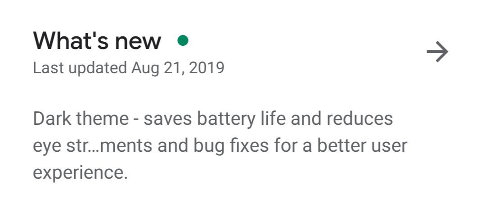
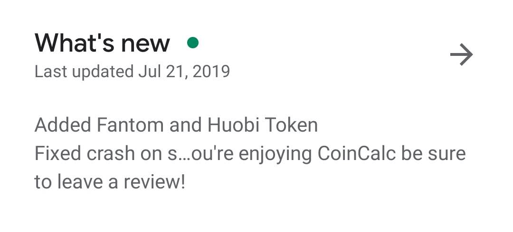

Safe ChangeLog Detector
=================

Since Google Play Store was updated to the new "Empire has won" (mostly white) design, it changed how *What's New* is displayed. This has, unfortunately, caused some hilarious, NSFW and unfortunate situations. To make things worse, the new mechanism, which joins the beginning and end of string, varies between screen size, font scaling and portrait/landscape mode.

</img>  </img>

**PayPal** ([from Reddit](https://www.reddit.com/r/mAndroidDev/comments/ctpfle/be_careful_new_play_store_joins_the_beginning_and/expwnji/))
```
New in this version: Improvements and bug... so you've always got the latest and greatest.
```

**HotStar** ([from Reddit](https://www.reddit.com/r/mAndroidDev/comments/ctpfle/be_careful_new_play_store_joins_the_beginning_and/expxjl9/))
```
We regularly update our app to provide you a...ss a thing, just keep your Updates turned on.
```

The idea of this project is to make a script that generates multiple possible outputs based on your changelog, so you can see if there is anything weird showing up. The script automatically checks for bad words and alerts you when it finds any. This way, you may have a peaceful night of sleep knowing nothing will disturb your users.
  
## Getting Started

You might supply an input path (via --path), an input (via --input) or nothing. If you supply nothing, the script will read from the clipboard.
You may also supply the maximum size, in chars, that a screen can have. If you don't supply anything, it will check against every size between 56 and 110, which should cover all cases.

```bash
// uber
$ ./safechangelog -i "We update the Uber app as often as possible to help make it faster and more reliable for you. This version includes several bug fixes and performance improvements.

Love the app? Rate us! Your feedback helps us to improve the Uber app.
Have a question? Tap Help in the Uber app or visit help.uber.com."

// hotstar
$ ./safechangelog -i "We regularly update our app to provide you an awesome video watching experience. To make sure you don't miss a thing, just keep your Updates turned on."

// from file
$ ./safechangelog -p changelog.txt

// from clipboard
$ ./safechangelog

// from clipboard + specific length
$ ./safechangelog -s96

// help (show all commands)
$ ./safechangelog --help
```  

| Fail | Pass |
|:-:|:-:|
|  |  |

```
$ ./safechangelog --help

USAGE:
    safechangelog [FLAGS] [OPTIONS]

FLAGS:
    -e, --errors-only    
    -h, --help           Prints help information
    -V, --version        Prints version information

OPTIONS:
    -d, --distance <distance>    The levenshtein distance to catch bad words. [default: 1]
    -i, --input <input>          The input that is going to be read
    -p, --path <path>            The path to the file that is going be read
    -s, --size <size>            The total size in chars for the output. When 0, script compares against every value between 56 and 110. [default: 0]
```

## Frequent Asked Questions

### Scientific method?
In a Galaxy S9 using standard display zoom and 2220x1080 resolution, it was measured 56 chars in portrait mode, 96 in landscape, 120 with reduced display zoom, 60 with increased display zoom. The script default interval is inspired by those values and should fit most devices.

### Why this project even exists?

I thought it was a good way to learn Rust. Kotlin is not good at scripting. You can't copy/paste without using JVM and unfortunately there is a bug in JVM's clipboard access. Then I went to Python, but it is too hard to compile/package a project when using virtual enviroments and multiple libraries -- is it even possible to do so? So I went to Rust and instantly loved it. Besides this, it was really fun to write an efficient program and make the CLI.  

### Isn't it useless?

I guess, yes? I mean, I don't *think* anyone will use in a regular basis, but if you do, please let me know! I would be really happy. Imagine if it were in the CI, it would be really awesome. If you need anything or would like to say thanks, just [open an issue](../../issues). I have a dream of having those stickers "used by Uber/Microsoft/Google/half the world" in a project made by me.

### How do I compile the project?
Just open this project's directory and call ```cargo build``` (or ```cargo build --release```).

### Issue tracking

Found a bug? Have an idea for an improvement? Feel free to [add an issue](../../issues).

### License

Copyright (c) 2019 Bernardo Ferrari

Permission is hereby granted, free of charge, to any person obtaining a copy of this software and associated documentation files (the "Software"), to deal in the Software without restriction, including without limitation the rights to use, copy, modify, merge, publish, distribute, sublicense, and/or sell copies of the Software, and to permit persons to whom the Software is furnished to do so, subject to the following conditions:

The above copyright notice and this permission notice shall be included in all copies or substantial portions of the Software.

THE SOFTWARE IS PROVIDED "AS IS", WITHOUT WARRANTY OF ANY KIND, EXPRESS OR IMPLIED, INCLUDING BUT NOT LIMITED TO THE WARRANTIES OF MERCHANTABILITY, FITNESS FOR A PARTICULAR PURPOSE AND NONINFRINGEMENT. IN NO EVENT SHALL THE AUTHORS OR COPYRIGHT HOLDERS BE LIABLE FOR ANY CLAIM, DAMAGES OR OTHER LIABILITY, WHETHER IN AN ACTION OF CONTRACT, TORT OR OTHERWISE, ARISING FROM, OUT OF OR IN CONNECTION WITH THE SOFTWARE OR THE USE OR OTHER DEALINGS IN THE SOFTWARE.